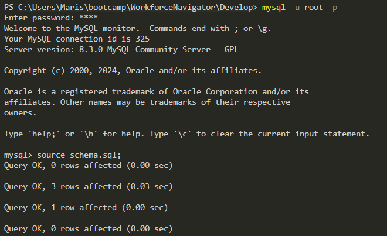
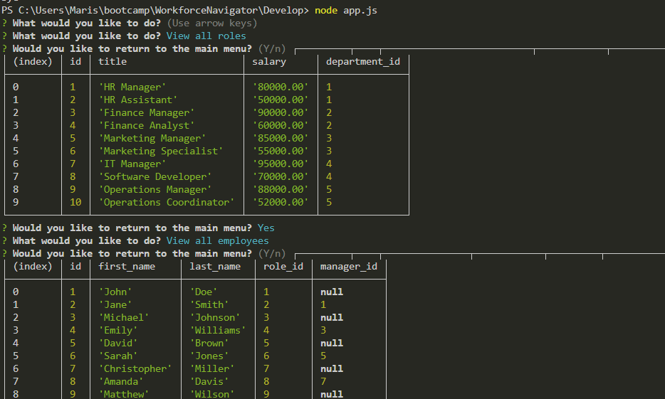

# WorkforceNavigator

My Task: 

My assignment is to build a command-line application from scratch to manage a company's employee database, using Node.js, Inquirer, and MySQL. Because the application won't be deployed I will also need to create a walkthrough video that demonstrates its functionality and all of the following acceptance criteria being met. I will submit a link to the video and add it to the README of your project.

## User Story: 
```
I WANT to be able to view and manage the departments, roles, and employees in my company
SO THAT I can organize and plan my business

```

## Acceptance Criteria:
```
GIVEN a command-line application that accepts user input
WHEN I start the application
THEN I am presented with the following options: view all departments, view all roles, view all employees, add a department, add a role, add an employee, and update an employee role
WHEN I choose to view all departments
THEN I am presented with a formatted table showing department names and department ids
WHEN I choose to view all roles
THEN I am presented with the job title, role id, the department that role belongs to, and the salary for that role
WHEN I choose to view all employees
THEN I am presented with a formatted table showing employee data, including employee ids, first names, last names, job titles, departments, salaries, and managers that the employees report to
WHEN I choose to add a department
THEN I am prompted to enter the name of the department and that department is added to the database
WHEN I choose to add a role
THEN I am prompted to enter the name, salary, and department for the role and that role is added to the database
WHEN I choose to add an employee
THEN I am prompted to enter the employee’s first name, last name, role, and manager, and that employee is added to the database
WHEN I choose to update an employee role
THEN I am prompted to select an employee to update and their new role and this information is updated in the database 
```
## Installation: 

Requires MySQl2, install inquirer using npm i and log in to mysql using mysql -u root -p and enter the password. Must source the schema.sql and seeds.sql; then exit the mysqL. Once the exit has completed then do the node app.js to view the menu. Using the arrow key you an navigate the menu. Once you select the specific area of the menu you want to see you can exit by selecting "y" on "n" to exit the area nd go back to the main menu.  


## Screen Shots: 
Sign in to root and source schema and seeds file: 



run the application using node app.js:




## Links to git Hub and Video: 

GitHub Link: 
https://github.com/Marisol514/WorkforceNavigator

Video Link: https://drive.google.com/file/d/1vsPBr85vfchs_LSRaV86VWiPMvc9bn3T/view 


## Rources: 

XpertLearning Assisant - BCS

https://www.npmjs.com/package/mysql2

https://github.com/mysqljs/mysql

https://sidorares.github.io/node-mysql2/docs/documentation/prepared-statements

https://sidorares.github.io/node-mysql2/docs/documentation/promise-wrapper 

https://medium.com/@sujathamudadla1213/what-is-the-use-of-env-8d6b3eb94843#:~:text=env%20file%20is%20used%20in,them%20directly%20into%20your%20code.

https://www.dotenv.org/docs/security/env
